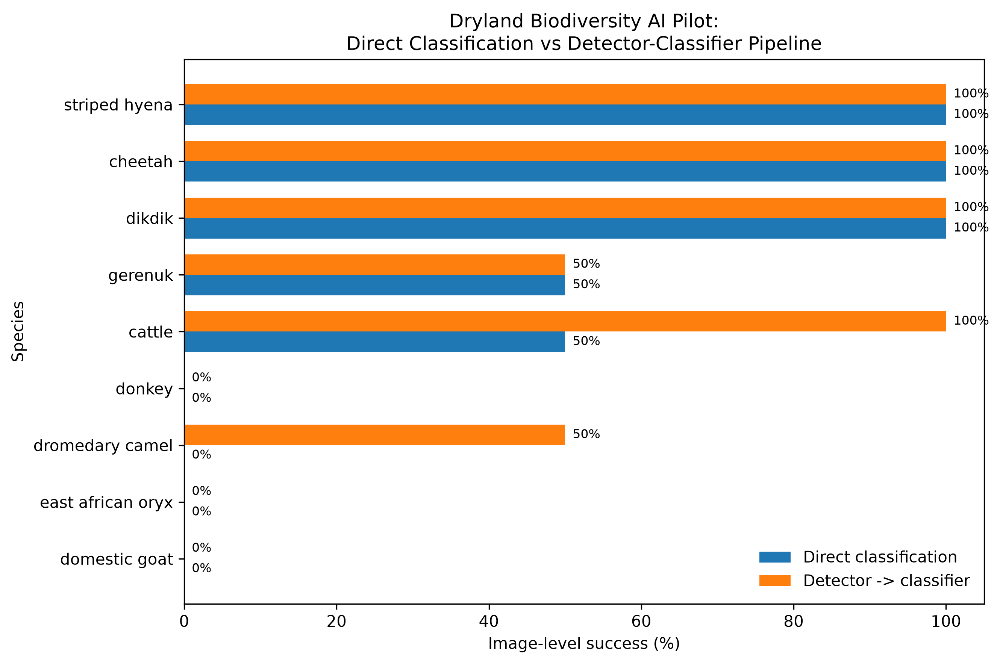

# Dryland Biodiversity AI

A reproducible exploratory workflow for evaluating dryland wildlife and pastoral-animal classification and preparing for biodiversity-climate integration in dryland landscapes.

## Project overview

This project tests two computer-vision workflows using the Microsoft AI for Good Lab **SPARROW Engine**:

1. direct full-image species classification;
2. animal detection followed by species classification.

The current work is an **exploratory transfer-performance pilot**, not a formal model benchmark.

## Pilot design

- **18 images**
- **9 target classes**
- **2 images per class**
- wildlife and pastoral livestock
- mostly ordinary photographs rather than camera-trap imagery
- one explicitly flagged out-of-region striped-hyena stress test

Target classes:

- cattle
- cheetah
- dikdik
- domestic goat
- donkey
- dromedary camel
- East African oryx
- gerenuk
- striped hyena

## Models and provenance

The workflow uses:

- `MDV6-yolov10-c` — MegaDetector animal detector
- `sub-saharan-drylands` — AddaxAI species classifier distributed through the SPARROW model zoo

The `sub-saharan-drylands` classifier is a **third-party AddaxAI model**, not a Microsoft-trained classifier. SPARROW lists it for eastern and southern Sub-Saharan African drylands under **CC BY-NC-SA 4.0**. The MegaDetector `MDV6-yolov10-c` detector is listed under **AGPL-3.0**.

Model weights are not stored in this repository.

SPARROW Engine:
https://github.com/microsoft/SPARROW-Engine

SPARROW model catalogue:
https://github.com/microsoft/SPARROW-Engine/blob/main/docs/model-zoo-catalogue.md

## Main results

| Evaluation | Correct | Image-level success |
|---|---:|---:|
| Direct classification | 8 / 18 | **44.4%** |
| Detector + classifier | 10 / 18 | **55.6%** |

The detector-classifier workflow improved image-level success by **11.1 percentage points**.

Two images that failed under direct classification were recovered after animal localization:

- `dromedary_camel_02`
- `cattle_01`

No image that was correct under direct classification became unsuccessful under the image-level pipeline rule.

## Species-level performance

| Species | Direct | Detector + classifier |
|---|---:|---:|
| cattle | 50% | 100% |
| cheetah | 100% | 100% |
| dikdik | 100% | 100% |
| domestic goat | 0% | 0% |
| donkey | 0% | 0% |
| dromedary camel | 0% | 50% |
| East African oryx | 0% | 0% |
| gerenuk | 50% | 50% |
| striped hyena | 100% | 100% |



## Interpretation

Performance varied strongly among taxa.

**Cheetah, dikdik, and striped hyena** were classified correctly in both images and both workflows.

Animal localization improved image-level performance for **cattle** and **dromedary camel**. However, **domestic goat, donkey, and East African oryx** remained unsuccessful in both workflows.

Several failed images still received strong animal detections, indicating that species-level classification rather than animal localization was often the main limitation.

East African oryx also showed repeated confusion with related ungulate classes, especially gemsbok.

## Evaluation rule

Direct classification is evaluated once per image.

For the detector-classifier workflow, an image is considered successful when at least one valid `animal` detection is classified as the true class.

Individual detections are retained for diagnostic analysis and are not treated as independent test images.

Exact model labels are preserved in the strict evaluation. For example, `cow` is not automatically counted as `cattle`.

## Repository structure

```text
dryland-biodiversity-ai/
├── data/
│   └── pilot_metadata.csv
├── docs/
│   └── pilot_results.md
├── figures/
│   ├── pilot_species_performance.png
│   └── pilot_species_performance.pdf
├── outputs/
│   ├── pilot_failure_diagnostics.csv
│   ├── pilot_image_summary.csv
│   ├── pilot_results.csv
│   └── pilot_species_summary.csv
├── scripts/
│   └── 05_pilot_analysis.py
├── .gitignore
├── README.md
└── requirements.txt
```

Pilot photographs are intentionally excluded from Git. Their source URLs, authorship, licensing, and image context are retained in `data/pilot_metadata.csv`.

## Reproduce the analysis

Install dependencies:

```bash
python -m pip install -r requirements.txt
```

Run the pilot analysis:

```bash
python scripts/05_pilot_analysis.py
```

The analysis script generates the species-performance figure and failure-diagnostic table from the processed pilot summaries.

Reproducing the original inference stage additionally requires SPARROW Engine plus the corresponding detector and classifier models.

## Key outputs

- `outputs/pilot_image_summary.csv`
- `outputs/pilot_species_summary.csv`
- `outputs/pilot_failure_diagnostics.csv`
- `outputs/pilot_results.csv`
- `docs/pilot_results.md`

## Limitations

This pilot should not be interpreted as a formal estimate of operational model accuracy.

Important limitations include:

- only 18 images;
- only two images per class;
- mostly ordinary photographs rather than independent camera-trap imagery;
- heterogeneous image backgrounds and conditions;
- possible geographic and visual-domain shift relative to model training data;
- one explicitly identified out-of-region striped-hyena stress test;
- image-level pipeline success can conceal mixed predictions within multi-animal scenes.

A larger independent camera-trap evaluation is required before making operational claims about performance in Somaliland or the wider Horn of Africa.

## Next phase: biodiversity × climate

The next stage will extend the project toward dryland ecological monitoring by linking biodiversity observations with agroclimatic and rangeland indicators such as:

- seasonal rainfall;
- rainfall anomalies;
- NDVI and vegetation condition;
- drought indicators;
- temperature;
- rangeland condition.

The longer-term research question is:

**How can AI-assisted biodiversity observations be combined with climate and vegetation information to support monitoring of dryland ecosystems and pastoral landscapes?**
